# PokeDecks App

Link Website: https://pokedeck-365eb.web.app/

## Competencies

- Vue.JS
- Nuxt.Js
- Vuetify
- Vuex
- Axios

## Release 0

Membuat halaman Home dengan path `/` yang menampilkan kumpulan `Pokemon` dari fetch 3rd API pada link [PokeAPI](https://pokeapi.co/api/v2/pokemon?limit=132).

Pada setiap cardnya akan terdapat data:
- Nama dari `Pokemon` tersebut.
- link gambar dari `Pokemon` tersebut.

Pada setiap cardnya juga akan terdapat sebuah button untuk melihat detail `Pokemon`.

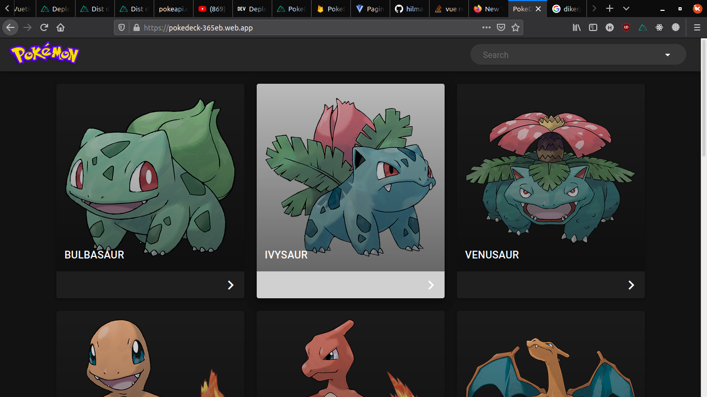

 

## Release 1

Membuat halaman Detail pada setiap `Pokemon` dengan path `/pokemon/:id`. Halaman detail juga terdapat siklus evolusi yang dialami oleh setiap pokemon, dan dihalaman ini user akan mengetahui pokemon yg dipilih berada dalam siklus evolusi ditingkat berapa.

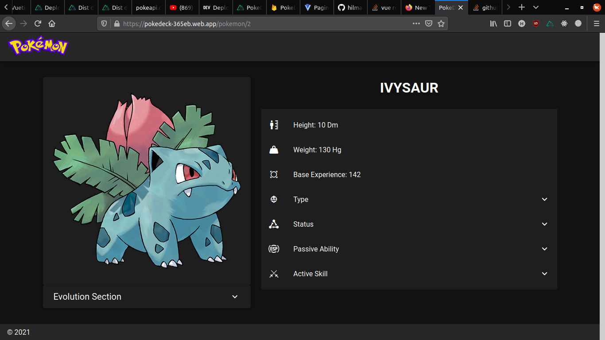
 
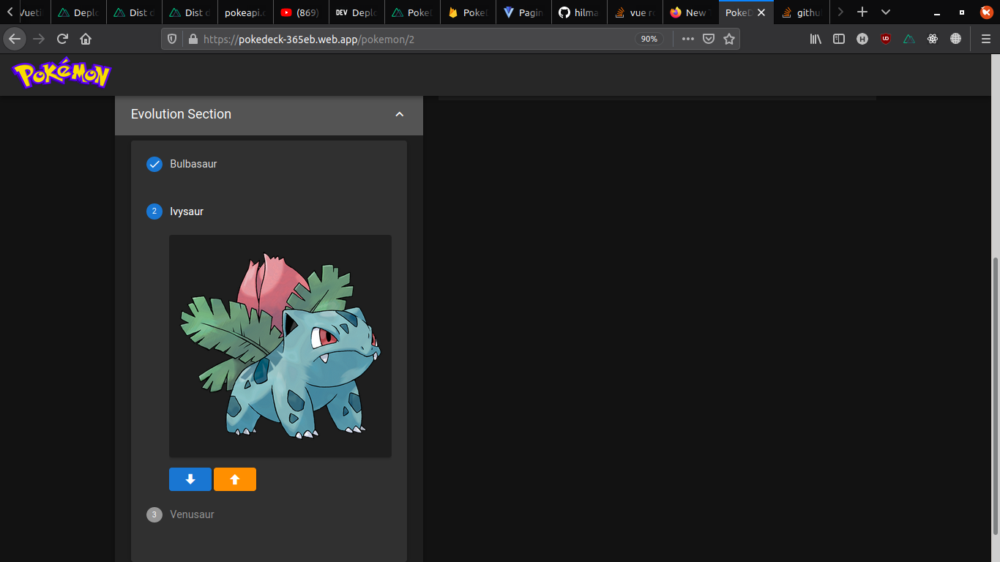

Pada halaman ini terdapat detail dari setiap pokemon seperti:
- Biodata dari `Pokemon` tersebut.
- Status dari `Pokemon` tersebut.
- Ability dari `Pokemon` tersebut.
- Type dari `Pokemon` tersebut.
- Skill dari `Pokemon` tersebut.

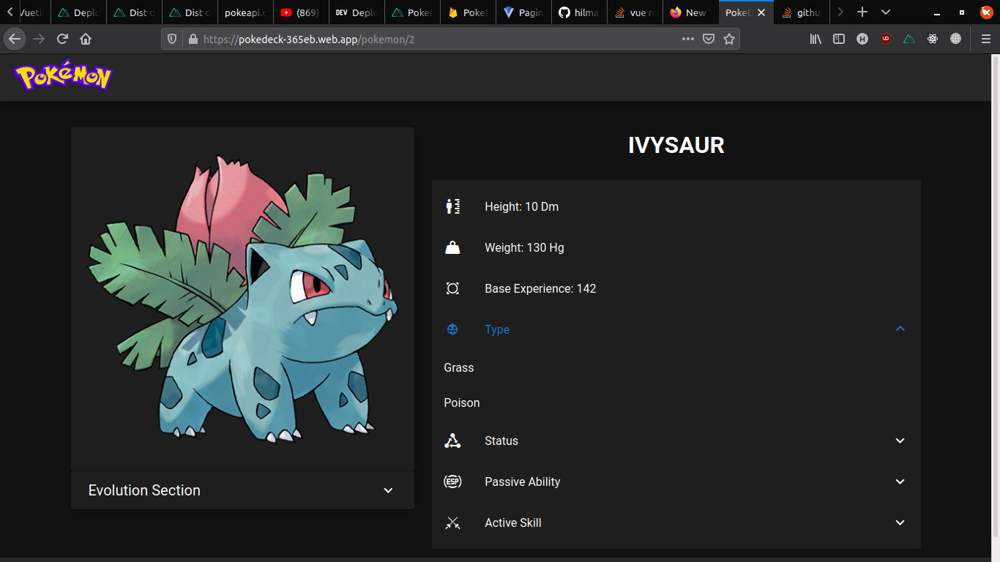

Pada halaman ini juga user dapat melihat detail pokemon di tahap siklus evolusi selain pokemon yang sedang dilihat

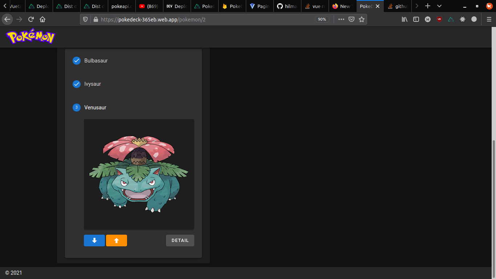

 

## Release 2

Membuat search dengan fitur autocomplete yaitu ketika user ingin mencari `Pokemon` yang diinginkan, maka search engine akan memberikan suggestion `Pokemon` yang ada distate pada user

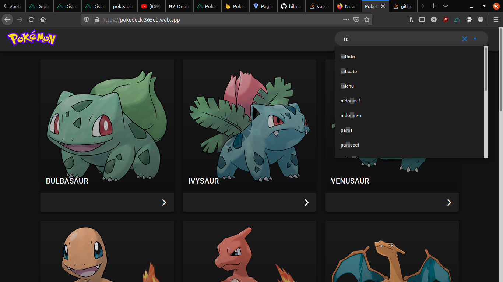

 

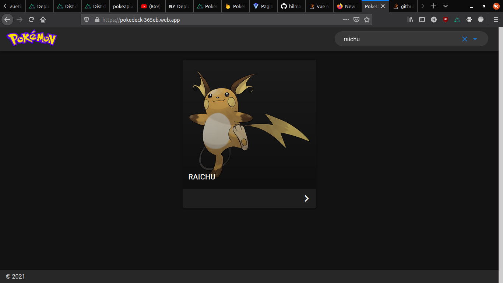

 

## Release 3

Membuat pagination agar list pokemon yang ditampilkan tidak terlalu panjang kebawah, pada project kali ini terdapat 11 halaman dengan 12 `Pokemon` yang ditampilkan pada setiap halaman.

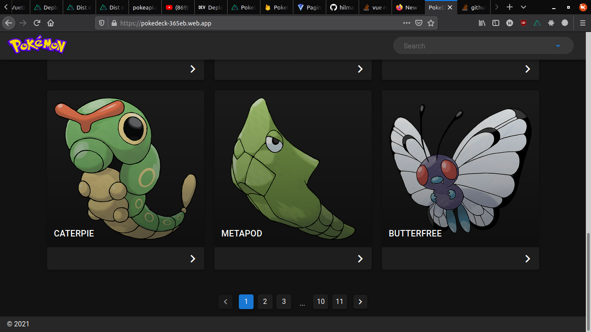

 

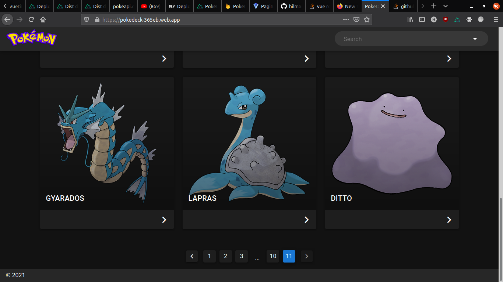

 

## Release 4

Membuat aplikasi yang responsive dan reactive untuk web dan juga mobile

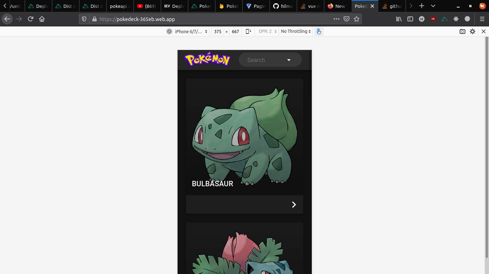

 

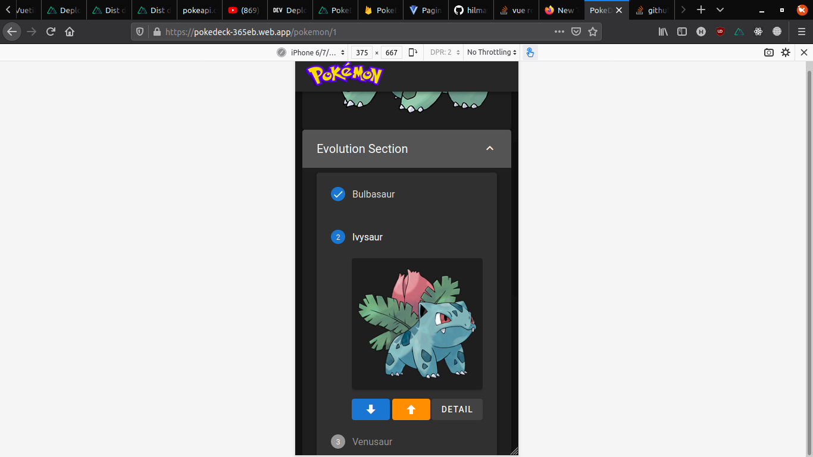

 

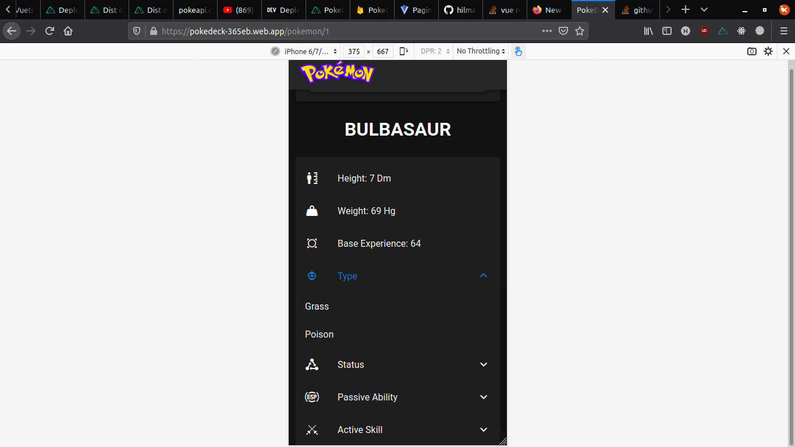

